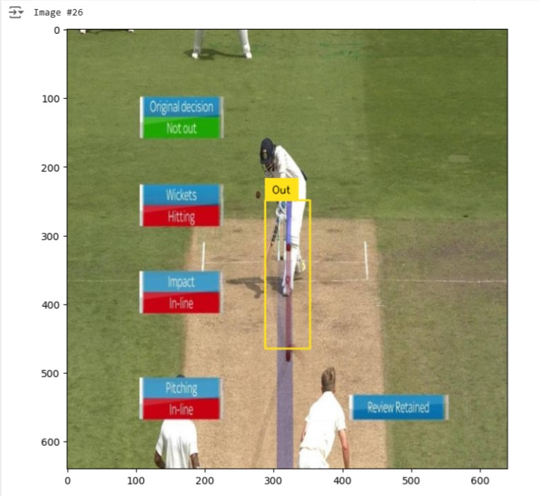
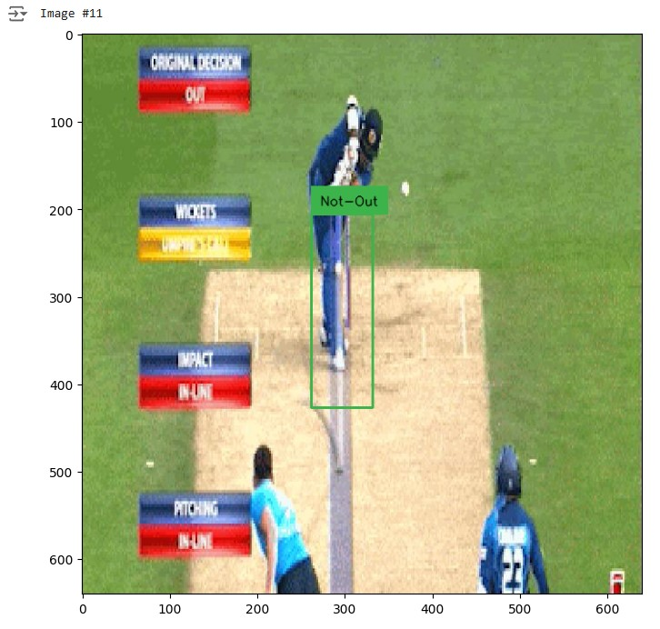

# LBW (cricket) Detection using Transformers

## Introduction

This Model is aimed to make a accurate prediction about whether it is "OUT" or "NOT OUT" using DETR (Pretrained Transformer) and 'facebook-resnet-fpn' i.e just Part-1. The actual reason behind this Model is Pitch Bounce varies from Pitch to Pitch so, sometimes it leads to a wrong decision. To avoid that it is necessary track the movement of the ball as well as measuring the relative distance when the ball is moving so, this reduces need of completely depending on predefined projection.

### Details :
#### Dependencies :
• Supervision

• Transformers (Model --> DETR_resnet_50)

• timm, torchvision

#### Outputs :

### Conclusion : 
The Model is detecting whether its 'OUT' or 'NOT OUT' from images the accuracy will improve after feeding more dataset to neural network.

• Note : This is just Part-1 of Project 'DRS_Sytem_using _ML' just to test the dataset so, I used transformers to save the time will update next parts of the project in this repo stay tuned 👍.
